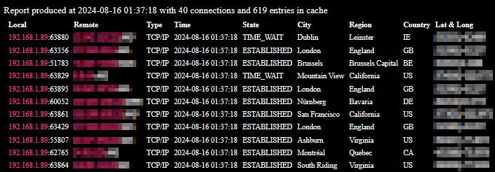

## Netmonitor Snapshot



Netmonitor snapshot is a report generator which produces readable html documents to outline the active TCP/UDP connections active on host machines. Its a useful utility for network load diagnostics and investigating what connections and ports are being utilised against the host machine.

## Requirements

Netmonitor Snapshot uses python as the primary software technology.

## Dependencies

```
pip install keyboard psutil requests ipaddress
```

## Usage Examples

To invoke Netmonitor snapshot in a commercial setting. You may invoke it using the form where -t implies a token exists for API access from a third party supplier (example: ipinfo.io) for geolocation data requests.

```
python main.py -t XXXXXXXXXXXXXX
```

The optional -f argument exists where a token exists but a non-commercial context exists to comply with the requirements of third party supply chain vendors. That is to kindly comply with their licensing models.

```
python main.py -t XXXXXXXXXXXXXX -f true
```

In order to minimise API requests Netmonitor Snapshot adopts a local disk cache to store lookup records for a maximum of 3-days before a forced update takes place. This minimises the load on third party suppliers and results in the runtime consistently becoming faster the longer the process time of the application increases.

To incur a pause between cycle times, the -m argument specifies the number of minutes to wait before the process resumes into sequential cycles.

```
python main.py -m 3
```

The -mr argument may be used to produce multiple reports and prevent the singleton report being overwritten.

```
python main.py -mr true
```

To perform a single pass and obtain a single report, the -sp argument exists and maybe used via the form:

```
python main.py -sp true
```

## List of Arguments

| Flag | Description                                                          |
|:----:|----------------------------------------------------------------------|
| t    | token key for ipinfo.io web service                                  |
| x    | flush the cache data and export to a comma separated value flat file |
| r    | overrides the global g_refresh_interval setting of 10 seconds        |
| f    | signals a non-commercial use case                                    |
| m    | the number of minutes to wait between each process cycle             |
| mr   | flag to produce multiple instead of a single document report         |
| sp   | flag to undertake a single pass through producing one report         |
